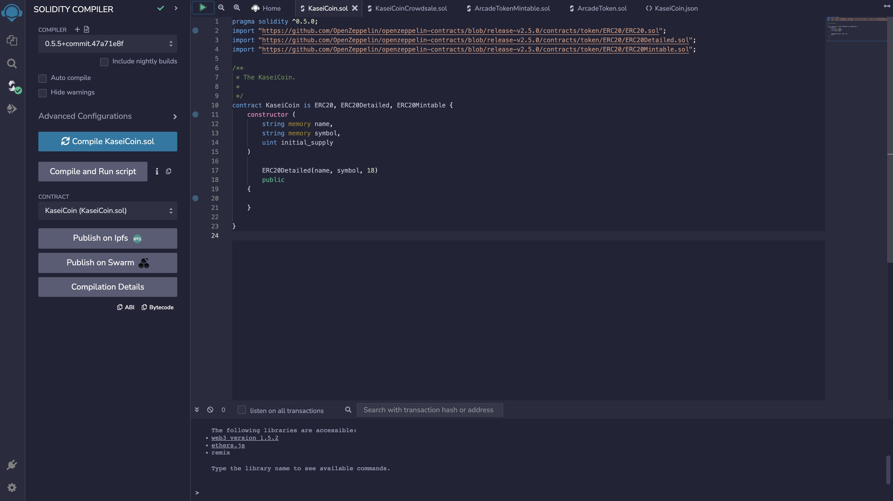
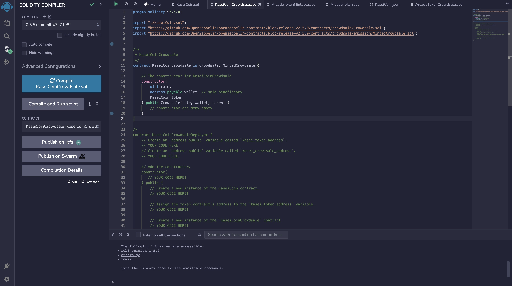
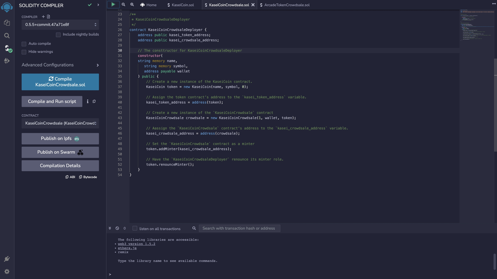

# TokenCrowdSale

## Description

In this example, we create a fungible token that is ERC-20 compliant and that will be minted by using a `Crowdsale` contract from the OpenZeppelin Solidity library.

The crowdsale contract that is created will manage the entire crowdsale process, allowing users to send ether to the contract and in return receive KAI, or KaseiCoin tokens. The contract will mint the tokens automatically and distribute them to buyers in one transaction.

The steps for this Challenge are divided into the following sections:

1. Create the KaseiCoin Token Contract

2. Create the KaseiCoin Crowdsale Contract

3. Create the KaseiCoin Deployer Contract

4. Deploy the Crowdsale to a Local Blockchain

5. Optional: Extend the Crowdsale Contract by Using OpenZeppelin

## Technologies

This example uses the following technologies:

- **Ethereum** - Ethereum is a decentralized, open-source blockchain with smart contract functionality.
- **Solidity** - Solidity is a statically-typed curly-braces programming language designed for developing smart contracts that run on Ethereum.
- **Remix IDE** - Remix IDE is an open-source, browser based tool that allows developers to create and test smart contracts using Solidity.
- **Open Zeppelin** - OpenZeppelin is an open-source platform for building secure dApps. The framework provides the required tools to create and automate Web3 applications.

## Evalulation Evidence

### Compiling the KaseiToken

### Compiling the KaseiTokenCrowdsale

### Compiling the KaseiTokenCrowdsaleDeployer

## Deploy the Crowdsale to a Local Blockchain

## Contributors

This sample application was authored by:

Quinn Wong (quinn.wong@gmail.com)
LinkedIn: https://www.linkedin.com/in/quinnwong/

## License

The MIT License (MIT)

Copyright (c) 2022 Quinn Wong

Permission is hereby granted, free of charge, to any person obtaining a copy of this software and associated documentation files (the "Software"), to deal in the Software without restriction, including without limitation the rights to use, copy, modify, merge, publish, distribute, sublicense, and/or sell copies of the Software, and to permit persons to whom the Software is furnished to do so, subject to the following conditions:

The above copyright notice and this permission notice shall be included in all copies or substantial portions of the Software.

THE SOFTWARE IS PROVIDED "AS IS", WITHOUT WARRANTY OF ANY KIND, EXPRESS OR IMPLIED, INCLUDING BUT NOT LIMITED TO THE WARRANTIES OF MERCHANTABILITY, FITNESS FOR A PARTICULAR PURPOSE AND NONINFRINGEMENT. IN NO EVENT SHALL THE AUTHORS OR COPYRIGHT HOLDERS BE LIABLE FOR ANY CLAIM, DAMAGES OR OTHER LIABILITY, WHETHER IN AN ACTION OF CONTRACT, TORT OR OTHERWISE, ARISING FROM, OUT OF OR IN CONNECTION WITH THE SOFTWARE OR THE USE OR OTHER DEALINGS IN THE SOFTWARE.
