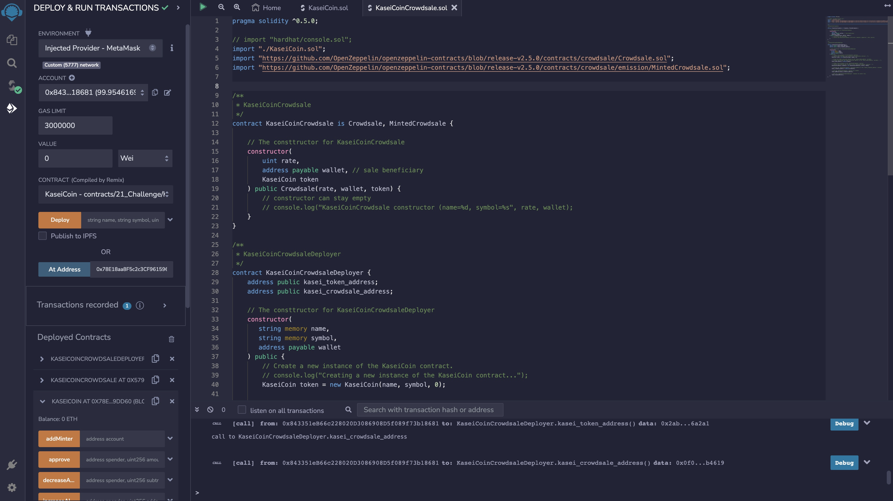

# TokenCrowdSale

## Description

In this example, we create a fungible token that is ERC-20 compliant and that will be minted by using a `Crowdsale` contract from the OpenZeppelin Solidity library.

The crowdsale contract that is created will manage the entire crowdsale process, allowing users to send ether to the contract and in return receive KAS, or KaseiCoin tokens. The contract will mint the tokens automatically and distribute them to buyers in one transaction.

The steps for this Challenge are divided into the following sections:

1. Create the KaseiCoin Token Contract

2. Create the KaseiCoin Crowdsale Contract

3. Create the KaseiCoin Deployer Contract

4. Deploy the Crowdsale to a Local Blockchain

5. Optional: Extend the Crowdsale Contract by Using OpenZeppelin

  

## Technologies

This example uses the following technologies:

- **Ethereum** - Ethereum is a decentralized, open-source blockchain with smart contract functionality.
- **Solidity** - Solidity is a statically-typed curly-braces programming language designed for developing smart contracts that run on Ethereum.
- **Remix IDE** - Remix IDE is an open-source, browser based tool that allows developers to create and test smart contracts using Solidity.
- **Open Zeppelin** - OpenZeppelin is an open-source platform for building secure dApps. The framework provides the required tools to create and automate Web3 applications.
- **MetaMask** - MetaMask is a digital wallet for the Ethereum blockchain.
- **Ganache** - Ganache allows you to fire up a personal Ethereum blockchain which you can use to run tests, execute commands, and inspect state while controlling how the chain operates.

  

## Evalulation Evidence

### Compiling the KaseiToken

The screenshot below illustrates compiling the KaseiToken in Remix IDE.
  

### Compiling the KaseiTokenCrowdsale

The screenshot below illustrates compiling the KaseiTokenCrowdsale in Remix IDE.
  

### Compiling the KaseiTokenCrowdsaleDeployer

The screenshot below illustrates compiling the KaseiTokenCrowdsaleDeployer in Remix IDE.
  

  

## Deploy the Crowdsale to a Local Blockchain

In this section, we provide the steps required to deploy and test a crowdsale of KaseiTokens.
  

### 1. Deploy the Crowdsale Smart Contracts

**Deploying KaseiTokenCrowdsaleDeployer**

The first step is to deploy the KaseiTokenCrowdsaleDeployer in RemixIDE, Ganache and MetaMask.
  

  
**Getting addresses for KaseiTokenCrowdsale and KaseiToken**

The next step is to capture the KaseiTokenCrowdsale and KaseiToken addresses. These will be used in the following steps for deploying the KaseiTokenCrowdsale and KaseiToken contracts.
  

  
**Deploying KaseiTokenCrowdsale**

Once we have the KaseiTokenCrowdsale address, we can deploy the KaseiTokenCrowdsale contract.
  

  

**Deploying KaseiToken**  
Once we have the KaseiToken address, we can deploy the KaseiToken contract.
  

  

### 2. Purchasing KAS Tokens.

Now that our smart contracts have been deployed in Remix, we can use different test accounts to purchase tokens.
  
**Account 3 purchases 5 KaseiTokens with 5 Ether**
 
In this example, we use Account 3 to purchase 5 KaseiTokens. To do, we do the following:

1. Go to MetaMask.
2. Select Account 3.
3. Go to Remix.
4. Enter in the number of KaseiTokens you wish to buy by entering in the value.
5. Scroll down to `Deployed Contracts` and click on `buyTokens`. Then click on the `Transact` button.

You should now have purchased 5 KAS tokens.

  

**Account 4 purchases 7 Kasei Tokens with 7 Ether**
 
In this example, we use Account 4 to purchase 7 KaseiTokens. To do, we do the following:

1. Go to MetaMask.
2. Select Account 4.
3. Go to Remix.
4. Enter in the number of KaseiTokens you wish to buy by entering in the value.
5. Scroll down to `Deployed Contracts` and click on `buyTokens`. Then click on the `Transact` button.

You should now have purchased 7 KAS tokens.

### 3. Confirming Purchases

After purchasing tokens with one or more test accounts, we can verify the the total supply of minted tokens and the amount of wei that has been raised in the crowdsale contract. To do so, we can view the accounts that were used in the smart contracts in Ganache.
  

  

## Contributors

This sample application was authored by:

Quinn Wong (quinn.wong@gmail.com)
LinkedIn: https://www.linkedin.com/in/quinnwong/

  

## License

The MIT License (MIT)

Copyright (c) 2022 Quinn Wong

Permission is hereby granted, free of charge, to any person obtaining a copy of this software and associated documentation files (the "Software"), to deal in the Software without restriction, including without limitation the rights to use, copy, modify, merge, publish, distribute, sublicense, and/or sell copies of the Software, and to permit persons to whom the Software is furnished to do so, subject to the following conditions:

The above copyright notice and this permission notice shall be included in all copies or substantial portions of the Software.

THE SOFTWARE IS PROVIDED "AS IS", WITHOUT WARRANTY OF ANY KIND, EXPRESS OR IMPLIED, INCLUDING BUT NOT LIMITED TO THE WARRANTIES OF MERCHANTABILITY, FITNESS FOR A PARTICULAR PURPOSE AND NONINFRINGEMENT. IN NO EVENT SHALL THE AUTHORS OR COPYRIGHT HOLDERS BE LIABLE FOR ANY CLAIM, DAMAGES OR OTHER LIABILITY, WHETHER IN AN ACTION OF CONTRACT, TORT OR OTHERWISE, ARISING FROM, OUT OF OR IN CONNECTION WITH THE SOFTWARE OR THE USE OR OTHER DEALINGS IN THE SOFTWARE.
